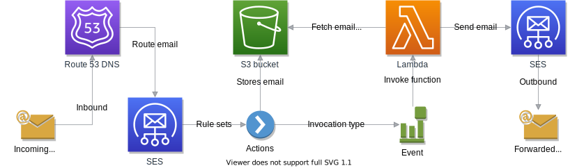

# AWS Lambda SES S3 Email Forwarder

A Node.js Lambda function that utilizes Amazon SES to forward incoming emails to an email address inbox. Setup Amazon SES to receive emails and deliver to a S3 bucket, then invoke lambda to forward the email to your email of choice.

## Architecture Diagram


## Features

* Serverless... no servers required because of Lambda.
* Cheap... can cost as low as a few cents.
* Parse email attachments.  Saves attachments to S3 and insert download links into email. Avoid SES email size limitations.
  * Receiving email: 30 MB
  * Sending email: 10 MB

## Requirements
1. Domain name
2. [AWS account](https://aws.amazon.com/)
3. [Unsanboxed Amazon SES account](https://docs.aws.amazon.com/ses/latest/DeveloperGuide/request-production-access.html)
4. [Verify your domain](https://docs.aws.amazon.com/ses/latest/DeveloperGuide/verify-domains.html)

## Installation

```sh
npm install
```

## Configuration
Create the following file inside the config folder.

### `config.js`

```js
exports.config = {
  attachmentPrefix: 'attachments/', // Attachment folder
  bucket: '', // S3 bucket
  cloudFront: '', // CloudFront distribtion domain name for S3 bucket (optional and you must setup this yourself first)
  forwardTo: [], // Email address destination
  from: '', // The email address that is sending the email.
  keyPrefix: 'email/', // Key prefix for S3 bucket
  region: '', // The region to send service requests to (not required if using CloudFront)
  sendingRate: 1, // How many messages per second is allowed to be delivered to SES
};
```

## Packaging

```sh
serverless package
```

## Deployment

```sh
serverless deploy --package .serverless
```

## Setup Email Receiving

### SES Rule set
[Create a receipt rule set](https://docs.aws.amazon.com/ses/latest/DeveloperGuide/receiving-email-receipt-rule-set.html)

1. [Create recipients](https://docs.aws.amazon.com/ses/latest/DeveloperGuide/receiving-email-receipt-rules.html)
2. [Create 2 actions in this exact order. S3 first, then Lambda.](https://docs.aws.amazon.com/ses/latest/DeveloperGuide/receiving-email-action.html)
    1. [S3 action](https://docs.aws.amazon.com/ses/latest/DeveloperGuide/receiving-email-action-s3.html)
        * S3 bucket - The name of the Amazon S3 bucket to which to save received emails.
        * Object key prefix - A key name prefix to use within the Amazon S3 bucket. (for example, email/)
        * Uncheck encrypt message (NOT RECOMMENDED because S3 client-side encryption is currently not supported for JavaScript.  [See documentation](https://docs.aws.amazon.com/general/latest/gr/aws_sdk_cryptography.html))
        * SNS Topic - Choose "None"
    2. [Lambda action](https://docs.aws.amazon.com/ses/latest/DeveloperGuide/receiving-email-action-lambda.html)
        * Lambda function: Choose the function that you created during deployment.
        * Invocation type: Choose "Event"
        * SNS Topic - Choose "None"
